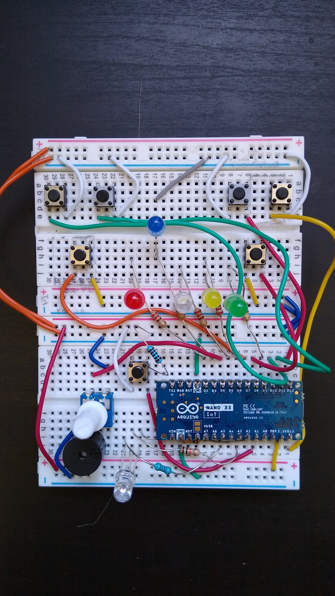
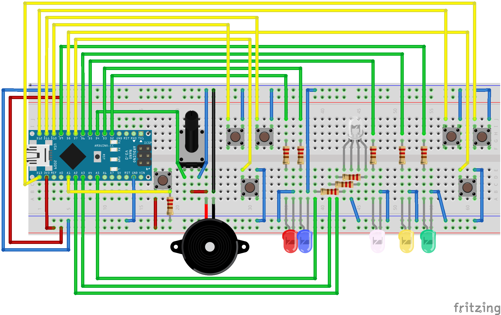

# Nanobox

Nanobox is a hobby project with the goal of developing a stand-alone system, based on an Arduino Nano 33 IoT, that can host simple games. Think of it as a gaming-controller that contains its own games.

The hardware consists of low-cost parts, specifically the Arduino at its core, 7 push-buttons, 5 colored LEDs, 1 common cathode multicolor LED, a potentiometer, a piezo-element, and a couple of resistors. That's it. The hardware will be housed in a plastic casing the size of a small gaming-controller for comfort and to fixate all its components. 

The project is under development on both fronts: Coding the first games and building the hardware. Once I found a satisfactory casing, I will post images of the completed system, in the meantime you can look at this breadboard-version of it: 

And here is the wiring diagram, if you want to hook up your own, **please note that Fritzing does not know the Nano 33 IoT**, yet, which is why I just use a Nano in the wiring diagram, the pinouts are mostly the same:

TODO: Explain hardware-test and explain Zimon game.
